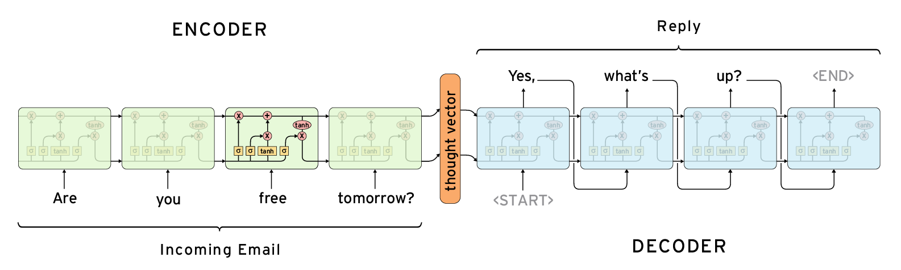

# Tensorflow Chatbot

Chatbot implementation using a trained in seq2seq model developed in Tensorflow and serving in a Flask server.

*Picture from [Deep Learning for Chatbots](http://www.wildml.com/2016/04/deep-learning-for-chatbots-part-1-introduction/)*

This project is divided in two parts:
	- The tensorflow implementation of the seq2seq model: chat.py
	- Webchat to get input from the user, "respond" them by running the model inference and display the output: main.py

The model construction is based on the following implementation [Advanced dynamic seq2seq](https://github.com/ematvey/tensorflow-seq2seq-tutorials), with modifications involving new datasets and ways of training.

Front-end is using this simple chat implementation on https://bootsnipp.com/snippets/featured/simple-chat, modified to make requests to the Flask server.

